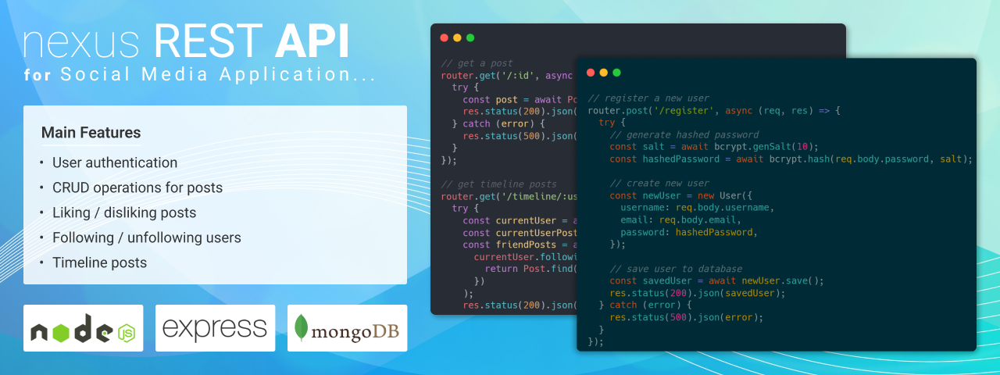

# nexus | REST API



This nexus REST API project is designed to be a comprehensive solution for a social media application, utilizing the power of Node.js, Express.js, and MongoDB. These technologies are known for their speed, scalability, and ease of use, making them a great choice for API development.

Our API will feature important functionalities, including user authentication, CRUD operations for posts, the ability to like and dislike posts, and the ability to follow and unfollow users. With these capabilities, users will have a seamless experience in using the API.

Let's get started!

## Installation

First you have to clone the repository and install the dependencies:

```bash
   git clone https://github.com/naieem-bd/nexus-REST-API.git
   cd nexus-REST-API
   npm install
```

## Environment

After cloning the project, you need to create a **.env** file in the project directory. You can copy the **.env.example** file and rename it to **.env**. 

```bash
   cp .env.example .env
```

You may change the **.env** file according to your needs. To change the **.env** file, open it with a text editor and change the values of the variables.

## Features

- User authentication
- CRUD operations for posts
- Liking / disliking posts
- Following / unfollowing users
- Timeline posts
- And many more

## Routes

There are 3 different routes-

#### Authentication routes

| HTTP Method | Resource URI | Description |
| :---------- | :----------- | :---------- |
| `POST` | http://localhost:2727/api/auth/register | Register a new user |
| `POST` | http://localhost:2727/api/auth/login | User login |

#### Users routes

| HTTP Method | Resource URI | Description |
| :---------- | :----------- | :---------- |
| `PUT` | http://localhost:2727/api/users/:id | Update a user |
| `DELETE` | http://localhost:2727/api/users/:id | Delete a user |
| `GET` | http://localhost:2727/api/users/:id | Get a user |
| `PUT` | http://localhost:2727/api/users/:id | Follow a user |
| `PUT` | http://localhost:2727/api/users/:id | Unfollow a user |

#### Posts routes

| HTTP Method | Resource URI | Description |
| :---------- | :----------- | :---------- |
| `POST` | http://localhost:2727/api/posts/ | Create a post |
| `PUT` | http://localhost:2727/api/posts/:id | Update a post |
| `PUT` | http://localhost:2727/api/posts/:id/like | Like or dislike a post |
| `GET` | http://localhost:2727/api/posts/:id | Get a post |
| `GET` | http://localhost:2727/api/posts/timeline/:userId | Get all timeline posts (own post and followings post) |
| `GET` | http://localhost:2727/api/posts/profile/:username | Get a user's all posts |